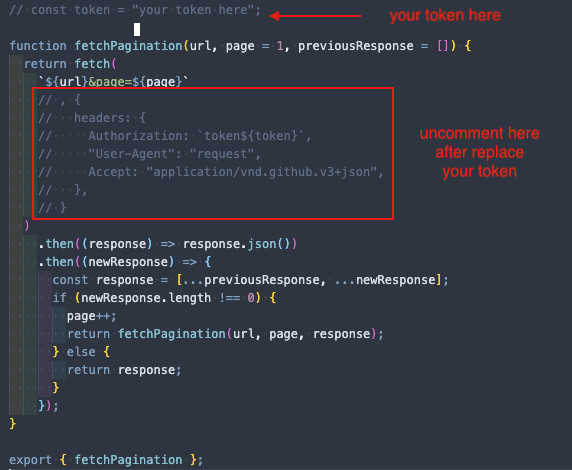

# GitHub unfollow tracker

This is a simple react project that i did as part of react practice.  
**GitHub unfollow tracker** allows you check who is unfollowed you and who you do not follow back

> Demo [here](https://git-hub-unfollower-tracker.vercel.app/)

## how does it works?

Pretty simple.
just type your GitHub user in the search box and hit search

## technologies

- React ([vite](https://vitejs.dev/))
- [styled components](https://styled-components.com/)

## GitHub token

GitHub can limit your access to 60 iterations,so please make a token and just added into constant variable called token, and uncomment the code that contains the headers that are going with the fetch, that will resolve the _API rate limit exceeded error_

use this screenshot as a reference  

